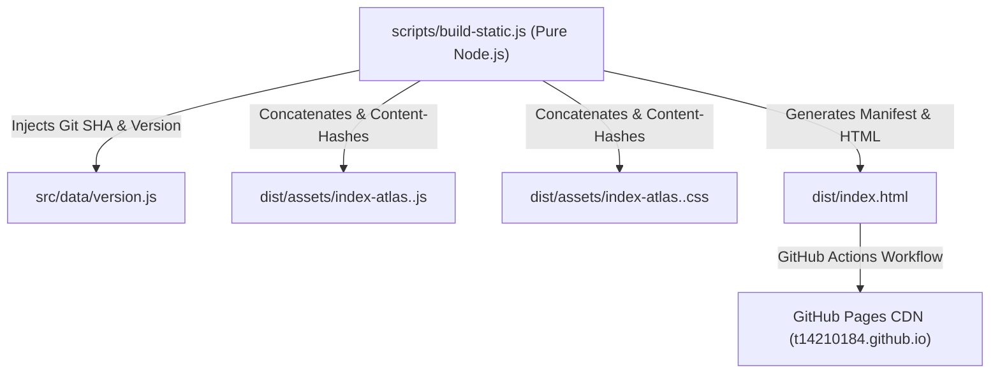

# System Architecture: Tokyo Waterbus Atlas

> **Version**: `v1.1.0-RC.3.22`  
> **Status**: Technical Architecture & Infrastructure Specification

---

## 🏗 Current Architecture: Zero-Dependency Static Frontend

Tokyo Waterbus Atlas is currently deployed as a zero-external-binary static web application hosted on GitHub Pages:

---

## 🔮 Future Scheduled Ingestion Architecture *(Planned for Phase 2)*

Because static GitHub Pages cannot independently guarantee real-time same-day status without scheduled backend triggers, a future serverless ingestion layer is planned:

- **Ingestion Worker**: Serverless worker (e.g. GitHub Actions Cron or Cloudflare Worker) executing scheduled fetches of official operator status pages.
- **Provenance Logging**: Storing cryptographic hashes, HTTP response headers, and raw HTML snapshots of official announcements.
- **Graceful Failure Mode**: If ingestion fails or operator status pages return 404/500 errors, status automatically reverts to Level D (`未知或資料過期`), hiding stale schedule estimates.
