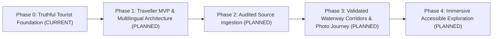

# Product Roadmap: Tokyo Waterbus Atlas

> **Version**: `v1.1.0-RC.3.22`  
> **Status**: Strategic Multi-Phase Development Plan

---

## 📌 Phase Overview

---

### Phase 0: Truthful Tourist Foundation *(CURRENT RELEASE: v1.1.0-RC.3.22)*
- **Objective**: Establish traveller-first UI, release identity integrity (`v1.1.0-RC.3.22 · <short-sha>`), official status gateway (`今天狀態`), user-controlled offline demo disclaimers, and comprehensive project documentation.
- **Dependencies**: Static frontend build pipeline.
- **Non-Goals**: Real-time scrapers, backend databases, geometry changes, full i18n translation.
- **Acceptance Criteria**: Pass `tests/pages/phase0-traveler-foundation.spec.js` and `scripts/audit-phase0-traveler-foundation.js`.

---

### Phase 1: Traveller MVP & Multilingual Architecture *(PLANNED / PROPOSED)*
- **Objective**: Implement 4-language i18n dictionary system (`zh-TW`, `en`, `ja`, `ko`), rich pier cards, station-to-pier walking direction indicators, and enhanced mobile sheet interactions.
- **Dependencies**: Phase 0 completion.
- **Non-Goals**: Automatic real-time status scraping.
- **Acceptance Criteria**: Dynamic language switching without page reload, accessibility target size compliance.

---

### Phase 2: Audited Source Ingestion & Timetable Estimates *(PLANNED / PROPOSED)*
- **Objective**: Deploy serverless scheduled ingestion layer to fetch official operator notices, parse timetable windows, and assign Level B trust ratings with provenance logs.
- **Dependencies**: Serverless worker environment & provenance logging architecture.
- **Non-Goals**: Live GPS vessel tracking claims.
- **Acceptance Criteria**: Automatic downgrade to Level D if ingestion fails or data becomes stale.

---

### Phase 3: Validated Waterway Corridors & Photo Wayfinding *(PLANNED / PROPOSED)*
- **Objective**: Transition route lines to validated water-surface corridors, incorporate CC-licensed last-300m station exit photo wayfinding, and implement human moderation workflows.
- **Dependencies**: Licensed photo repository & human approval workflow gates.
- **Non-Goals**: Unlicensed social media photo scraping.
- **Acceptance Criteria**: Zero land-crossing polylines and verified CC attribution metadata for all images.

---

### Phase 4: Immersive Accessible Remote Exploration *(PLANNED / PROPOSED)*
- **Objective**: WebGL/3D waterway exploration, audio guides, screen-reader optimized navigation, and wheelchair-accessible route routing.
- **Dependencies**: Validated 3D waterway assets and WCAG 2.1 AAA accessibility audits.
- **Acceptance Criteria**: Full screen-reader keyboard usability and accessible alternative route suggestions.
